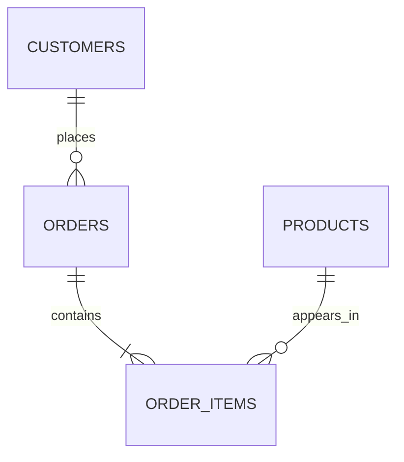

# Sales Database Schema

## 1. Dataset Analysis

Source: `assigment-docs/sales_data.csv`

- **Rows:** 1,200 data rows, excluding the header.
- **Columns:** 16.
- **Order IDs:** 1,200 distinct values, sequential from 1 through 1,200; no duplicates.
- **Customers:** 20 distinct `customer_id` values.
- **Products:** 12 distinct `product_id` values.
- **Missing values:** None observed in the 16 CSV columns.
- **Timestamp format:** UTC ISO-8601 timestamps, for example `2026-02-27T04:47:00Z`.
- **Statuses:** `completed` (689), `pending` (183), `refunded` (164), `cancelled` (164).
- **Payment methods:** `card` (714), `paypal` (243), `bank_transfer` (243).
- **Channels:** `web` (697), `mobile` (503).
- **Categories:** `Electronics`, `Accessories`, `Home Office`, `Stationery`, `Lifestyle`.
- **Countries:** 13 distinct country values.
- **Amount consistency:** Every row matches the source generator's binary floating-point calculation of `quantity * unit_price * (1 - discount_pct / 100)`, formatted to two decimal places using Python-style float behavior.

### Columns and observed meanings

| CSV column | Observed type | Meaning and proposed destination |
|---|---|---|
| `order_id` | Integer | Source order identifier; `orders.order_id` primary key |
| `order_date` | UTC timestamp | Time the order was recorded; `orders.order_date` |
| `customer_id` | Integer | Customer identifier; foreign key to `customers` |
| `customer_name` | Text | Customer display name; `customers.customer_name` |
| `customer_email` | Text | Customer email; `customers.customer_email` |
| `country` | Text | Customer country; `customers.country` |
| `product_id` | Integer | Product identifier; foreign key to `products` |
| `product_name` | Text | Product display name; `products.product_name` |
| `category` | Text | Product category; `products.category` |
| `quantity` | Integer | Number of units; `order_items.quantity` |
| `unit_price` | Decimal | Price per unit at the time of sale; `order_items.unit_price` |
| `discount_pct` | Decimal | Percentage discount applied to the line; `order_items.discount_pct` |
| `total_amount` | Decimal | Discounted line total; `order_items.total_amount` |
| `status` | Controlled text | Order lifecycle status; `orders.status` |
| `payment_method` | Controlled text | Payment method; `orders.payment_method` |
| `channel` | Controlled text | Sales channel; `orders.channel` |

The CSV is denormalized because customer and product attributes repeat on every sale. The proposed design separates stable customer, product, order, and order-line data. Because the current file has one product per order, each imported order initially has one order item. The `orders` and `order_items` split supports future orders containing multiple products.

## 2. Proposed Database Schema

### `customers`

Stores one customer per authoritative `customer_id`.

| Column | Type | Nullability | Constraints/default |
|---|---|---|---|
| `customer_id` | `BIGINT` | `NOT NULL` | Primary key; source identifier |
| `customer_name` | `TEXT` | `NOT NULL` | Must not be blank |
| `customer_email` | `TEXT` | `NOT NULL` | No uniqueness constraint is proposed; `customer_id` is authoritative |
| `country` | `TEXT` | `NOT NULL` | Must not be blank |

### `products`

Stores one product per authoritative `product_id`.

| Column | Type | Nullability | Constraints/default |
|---|---|---|---|
| `product_id` | `BIGINT` | `NOT NULL` | Primary key; source identifier |
| `product_name` | `TEXT` | `NOT NULL` | Must not be blank |
| `category` | `TEXT` | `NOT NULL` | Must not be blank |

### `orders`

Stores order-level attributes. `order_id` remains the source key because it is unique and sequential in the supplied file.

| Column | Type | Nullability | Constraints/default |
|---|---|---|---|
| `order_id` | `BIGINT` | `NOT NULL` | Primary key; source identifier |
| `order_date` | `TIMESTAMPTZ` | `NOT NULL` | Stored with timezone |
| `customer_id` | `BIGINT` | `NOT NULL` | Foreign key to `customers(customer_id)` |
| `customer_name_snapshot` | `TEXT` | `NOT NULL` | Source value at order time |
| `customer_email_snapshot` | `TEXT` | `NOT NULL` | Source value at order time |
| `country_snapshot` | `TEXT` | `NOT NULL` | Source value at order time |
| `status` | `TEXT` | `NOT NULL` | `completed`, `pending`, `refunded`, or `cancelled` |
| `payment_method` | `TEXT` | `NOT NULL` | `card`, `paypal`, or `bank_transfer` |
| `channel` | `TEXT` | `NOT NULL` | `web` or `mobile` |

The snapshots preserve the source record for audit and historical reporting while the customer foreign key supports current customer lookups. They should be retained unless the business explicitly decides that historical customer attributes are unnecessary.

### `order_items`

Stores the products and financial values associated with an order.

| Column | Type | Nullability | Constraints/default |
|---|---|---|---|
| `order_item_id` | `BIGINT GENERATED ALWAYS AS IDENTITY` | `NOT NULL` | Primary key |
| `order_id` | `BIGINT` | `NOT NULL` | Foreign key to `orders(order_id)` |
| `product_id` | `BIGINT` | `NOT NULL` | Foreign key to `products(product_id)` |
| `product_name_snapshot` | `TEXT` | `NOT NULL` | Source value at sale time |
| `category_snapshot` | `TEXT` | `NOT NULL` | Source value at sale time |
| `quantity` | `INTEGER` | `NOT NULL` | Greater than zero |
| `unit_price` | `NUMERIC(12,2)` | `NOT NULL` | Non-negative |
| `discount_pct` | `NUMERIC(5,2)` | `NOT NULL` | Between 0 and 100 |
| `total_amount` | `NUMERIC(12,2)` | `NOT NULL` | Non-negative; discounted line total |

No uniqueness constraint is placed on `(order_id, product_id)`, because a future order may legitimately contain multiple lines for the same product with different prices or discounts.

### Currency and monetary assumptions

The CSV does not contain a currency column. The schema therefore does not invent a currency code. Before production use, confirm whether all monetary values use one currency. If multiple currencies are possible, add a required ISO-4217 `currency_code` to `orders` or `order_items` before importing data.

The supplied values use two decimal places and follow cent rounding. The design treats `total_amount` as the discounted line total, excluding tax and shipping, but this is an assumption requiring business confirmation.

## 3. Relationships



- One customer can place many orders.
- Each order belongs to exactly one customer.
- Each order contains one or more order items.
- One product can appear in many order items.
- The current CSV has one order item per order, but the schema does not depend on that limitation.

## 4. Indexes

Primary keys and the unique constraints created by PostgreSQL already provide indexes for entity lookups. The following additional indexes are justified by likely query patterns:

| Index | Query supported | Reason |
|---|---|---|
| `orders_customer_date_idx` on `orders(customer_id, order_date DESC)` | A customer's orders ordered by newest first | Combines the join/filter key with the common date ordering |
| `orders_date_idx` on `orders(order_date)` | Date-range sales and time-series reports | Supports filtering and range scans by order timestamp |
| `orders_status_date_idx` on `orders(status, order_date)` | Completed sales or other status-specific date ranges | Useful for revenue queries that filter by lifecycle status |
| `order_items_product_idx` on `order_items(product_id)` | Sales by product or category through the product join | Foreign keys do not automatically index referencing columns |

Do not add indexes to every text attribute or to `payment_method`/`channel` without query evidence. The status index should be reconsidered if status-filtered queries are uncommon or the table remains very small.

## 5. Data Quality and Assumptions

- `customer_id` is treated as the stable customer identity. The same email appears consistently for each observed customer, but email uniqueness is not enforced because that business rule is not stated.
- `product_id` is treated as the stable product identity. Product name and category are retained as order-item snapshots so historical rows remain explainable if the product catalog changes.
- `order_id` is unique in this file. It is treated as an order identifier, while the schema still supports multiple order items per order.
- `order_date` is interpreted as a UTC instant and stored as `TIMESTAMPTZ`. Reporting timezone has not been specified.
- The primary revenue examples count `completed` orders only. `pending` represents an unresolved state; `refunded` and `cancelled` are excluded from recognized revenue. Alternative operational reports may intentionally include them.
- `total_amount` is assumed to be the source generator's binary floating-point calculation of `quantity * unit_price * (1 - discount_pct / 100)`, formatted to two decimal places using Python-style float behavior. Tax, shipping, and currency are not represented in the source.
- Status, payment method, and channel use `TEXT` plus `CHECK` constraints instead of PostgreSQL enums so values can evolve through a controlled migration. Lookup tables would be preferable if these values require metadata, localization, or administration.
- No nulls or duplicate order IDs were observed. Future imports must still validate these conditions.
- The accompanying PDF is outside the scope of this design; the CSV and this task document are the requirements sources.

## 6. Example Queries

### Total completed sales

```sql
SELECT COALESCE(SUM(oi.total_amount), 0) AS completed_sales
FROM orders AS o
JOIN order_items AS oi ON oi.order_id = o.order_id
WHERE o.status = 'completed';
```

### Sales by customer

```sql
SELECT c.customer_id, c.customer_name, SUM(oi.total_amount) AS sales
FROM customers AS c
JOIN orders AS o ON o.customer_id = c.customer_id
JOIN order_items AS oi ON oi.order_id = o.order_id
WHERE o.status = 'completed'
GROUP BY c.customer_id, c.customer_name
ORDER BY sales DESC;
```

### Sales by product and category

```sql
SELECT p.product_id, p.product_name, p.category,
       SUM(oi.quantity) AS units_sold,
       SUM(oi.total_amount) AS sales
FROM products AS p
JOIN order_items AS oi ON oi.product_id = p.product_id
JOIN orders AS o ON o.order_id = oi.order_id
WHERE o.status = 'completed'
GROUP BY p.product_id, p.product_name, p.category
ORDER BY sales DESC;
```

### Sales over time

```sql
SELECT DATE_TRUNC('month', o.order_date AT TIME ZONE 'UTC') AS month,
       SUM(oi.total_amount) AS sales
FROM orders AS o
JOIN order_items AS oi ON oi.order_id = o.order_id
WHERE o.status = 'completed'
GROUP BY month
ORDER BY month;
```

### Top customers

```sql
SELECT c.customer_id, c.customer_name,
       COUNT(DISTINCT o.order_id) AS order_count,
       SUM(oi.total_amount) AS sales
FROM customers AS c
JOIN orders AS o ON o.customer_id = c.customer_id
JOIN order_items AS oi ON oi.order_id = o.order_id
WHERE o.status = 'completed'
GROUP BY c.customer_id, c.customer_name
ORDER BY sales DESC
LIMIT 10;
```

### Date and status filtering

```sql
SELECT o.order_id, o.order_date, o.status, oi.total_amount
FROM orders AS o
JOIN order_items AS oi ON oi.order_id = o.order_id
WHERE o.order_date >= TIMESTAMPTZ '2026-01-01 00:00:00+00'
  AND o.order_date <  TIMESTAMPTZ '2026-02-01 00:00:00+00'
  AND o.status = 'completed'
ORDER BY o.order_date;
```

## 7. PostgreSQL DDL

```sql
CREATE TABLE customers (
    customer_id BIGINT PRIMARY KEY,
    customer_name TEXT NOT NULL CHECK (btrim(customer_name) <> ''),
    customer_email TEXT NOT NULL CHECK (btrim(customer_email) <> ''),
    country TEXT NOT NULL CHECK (btrim(country) <> '')
);

CREATE TABLE products (
    product_id BIGINT PRIMARY KEY,
    product_name TEXT NOT NULL CHECK (btrim(product_name) <> ''),
    category TEXT NOT NULL CHECK (btrim(category) <> '')
);

CREATE TABLE orders (
    order_id BIGINT PRIMARY KEY,
    order_date TIMESTAMPTZ NOT NULL,
    customer_id BIGINT NOT NULL REFERENCES customers(customer_id),
    customer_name_snapshot TEXT NOT NULL CHECK (btrim(customer_name_snapshot) <> ''),
    customer_email_snapshot TEXT NOT NULL CHECK (btrim(customer_email_snapshot) <> ''),
    country_snapshot TEXT NOT NULL CHECK (btrim(country_snapshot) <> ''),
    status TEXT NOT NULL CHECK (status IN ('completed', 'pending', 'refunded', 'cancelled')),
    payment_method TEXT NOT NULL CHECK (payment_method IN ('card', 'paypal', 'bank_transfer')),
    channel TEXT NOT NULL CHECK (channel IN ('web', 'mobile'))
);

CREATE TABLE order_items (
    order_item_id BIGINT GENERATED ALWAYS AS IDENTITY PRIMARY KEY,
    order_id BIGINT NOT NULL REFERENCES orders(order_id) ON DELETE RESTRICT,
    product_id BIGINT NOT NULL REFERENCES products(product_id) ON DELETE RESTRICT,
    product_name_snapshot TEXT NOT NULL CHECK (btrim(product_name_snapshot) <> ''),
    category_snapshot TEXT NOT NULL CHECK (btrim(category_snapshot) <> ''),
    quantity INTEGER NOT NULL CHECK (quantity > 0),
    unit_price NUMERIC(12, 2) NOT NULL CHECK (unit_price >= 0),
    discount_pct NUMERIC(5, 2) NOT NULL CHECK (discount_pct BETWEEN 0 AND 100),
    total_amount NUMERIC(12, 2) NOT NULL CHECK (total_amount >= 0),
    CHECK (
        total_amount = round(quantity * unit_price * (1 - discount_pct / 100), 2)
    )
);

CREATE INDEX orders_customer_date_idx
    ON orders (customer_id, order_date DESC);

CREATE INDEX orders_date_idx
    ON orders (order_date);

CREATE INDEX orders_status_date_idx
    ON orders (status, order_date);

CREATE INDEX order_items_product_idx
    ON order_items (product_id);
```

The DDL check for `total_amount` encodes the arithmetic observed in the CSV. If the business confirms a different rounding policy, taxes, shipping, or multiple currencies, revise that constraint and the monetary model before creating migrations.